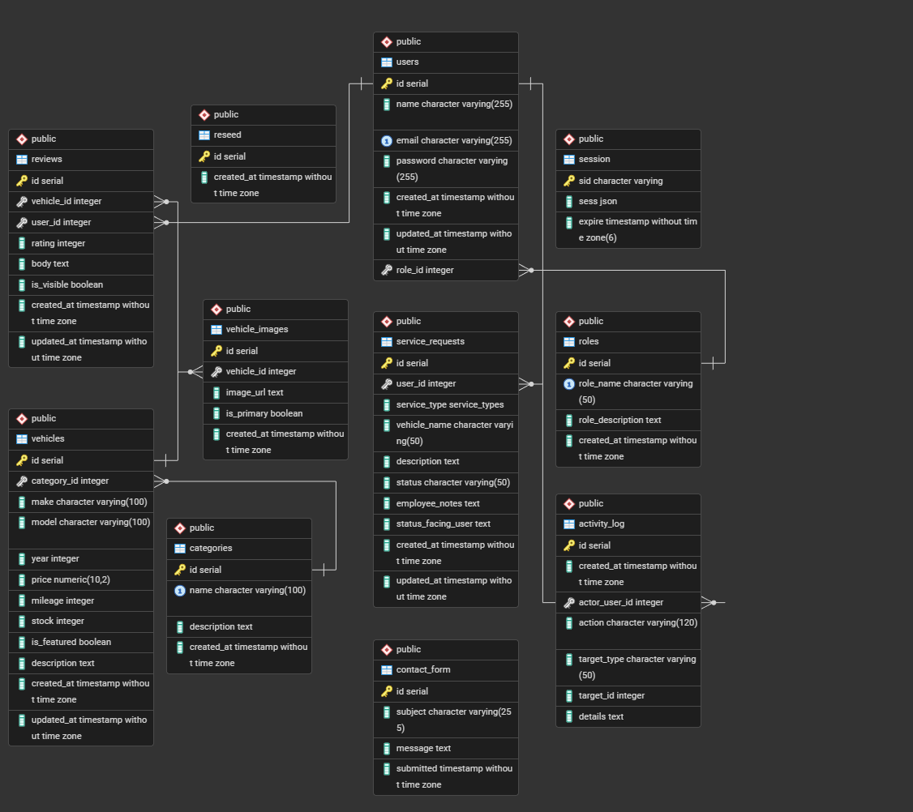

# Fuse Automobiles / cse340-car-dealership

Project repository for the CSE 340 final project, a car dealership site made with Express and node.js.

[Visit the Render site for the project here.](https://fuse-automobile.onrender.com/)

## Database Schema

## User Roles

| Role | Description |
| --- | --- |
| **user** | Default registered customer. Can use the dashboard, submit and track service requests, and create reviews on vehicles. Can edit or delete their own reviews.|
| **employee** | Staff role. Includes everything a default user can do, plus moderation to review and edit service requests, review contact submissions, approve or reject reviews, and edit vehicle inventory data. |
| **admin** | Full access. Includes all employee capabilities plus account and permission management, the ability to add, delete, and edit vehicle categories as well as entire vehicles, and permission to view the database log.|

Role names come from the `roles` table (`user`, `employee`, `admin`) and are stored on each row in `users.role_id`.

## Test Account Credentials

| Role | Email |
| --- | --- |
| user | `idonteven@gmail.com` |
| employee | `funemployee@example.com` |
| admin | `admin@example.com` |

## Known Limitations

* Vehicle photos use external URLs located inside the database. if a third-party host drops an image, the UI will show a placeholder or broken image until URLs are updated.
* New reviews require staff approval (`is_visible`) before they appear publicly, depending on moderation workflow.
* Mobile view could use improvements with layout and styling. While the entire site should be functional on mobile, it may not be as clean looking as desktop.

### Technology Stack

* Node.js with Express.js as the backend framework
* EJS or Liquid.js for rendering views
* ESM (ECMAScript Modules), no CommonJS (require is not allowed)
* PostgreSQL for the database
* Deployed on Render with a connected PostgreSQL database

## Project Checklist

### Public Pages

* [X] Home page with featured vehicles
* [X] Browse vehicles by category (Trucks, Vans, Cars, SUVs)
* [X] Individual vehicle detail pages with images, specs, and price
* [X] Contact form (saves to database)

### User Features (must be logged in)

* [X] Leave reviews on vehicles
* [X] Edit/delete own reviews
* [X] Submit service requests for their vehicle (oil change, inspection, etc.)
* [X] View history of service requests and their status

### Employee Dashboard:

* [X] Edit vehicle details (price, description, availability)
* [X] Moderate/delete inappropriate reviews
* [X] View and manage service requests
* [X] Update service request status (Submitted, In Progress, Completed)
* [X] Add notes to service requests
* [X] View contact form submissions

### Owner Dashboard (Full Admin):

* [X] Everything employees can do, plus:
* [X] Add, edit, and delete vehicle categories
* [X] Add, edit, and delete vehicles from inventory
* [X] Manage employee accounts (optional, can be hardcoded)
* [X] View all system activity and user data

### Database Requirements:

Database Requirements:
* [X] Users table (with role field)
* [X] Vehicles table
* [X] Categories table (linked to vehicles)
* [X] Reviews table (linked to users and vehicles)
* [X] Service requests table (linked to users, with status tracking)
* [X] Contact messages table
* [X] Vehicle images table (one-to-many with vehicles)
